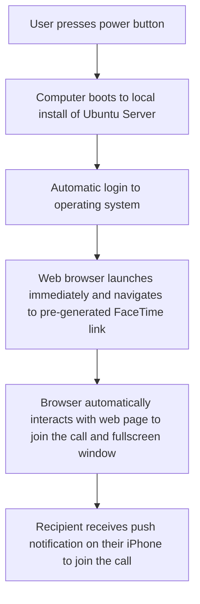
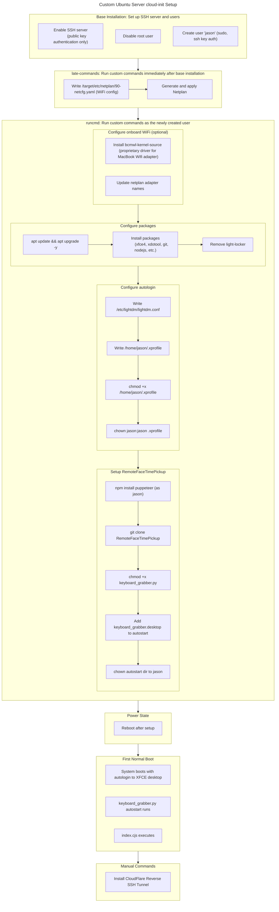

<div class="col-sm mt-3 mt-md-0">
    
</div>
<div class="caption">
    Video demonstration of a laptop placing an automated FaceTime call.
</div>

> tl;dr: **What is it?** A customized Ubuntu Server installation for easily placing FaceTime calls. This system has been installed autonomously using cloud-init, an automated Linux setup tool, and tested using Hyper-V, a Windows virtualization tool.

This project was created as a solution to help my family communicate with each other more effectively while away from one another. Implemented on a Macbook Air (Intel CPU) laptop running the Ubuntu Server operating system, this highly customized computer only requires a **single push of the power button to launch a video call**. For context, one would typically need the following to place a video call:

- A **phone/laptop/computer** set up with a local or an online/vendor account (e.g. Microsoft, iCloud) and connected to the internet
- An **email** to create an **account** with a video calling platform (e.g. Zoom, iCloud)

In addition to these one-time hurtles, the user would then need to sign in and maintain up-to-date software on their device. They would need to navigate to their video calling platform _every time_ they want to make a call. The _Automated FaceTime Pickup System_ consists of an off-the-shelf computer and customized Linux installation to allow the user to press **a single button** to launch a call—the power button.

<br>

<div class="col-sm-8 mt-3 mt-md-0 mx-auto">
  
</div>
<div class="caption">
    The destination of a FaceTime join link. In this project, we automate the process of opening this link, entering our name, pressing "Continue", and maximizing the browser.
</div>

<br>

Below is a block diagram of the steps the laptop takes to place a FaceTime call:



## Development

This project is built on Apple FaceTime and the fact that FaceTime offers iOS users the ability generate invitation links that don't require authentication. A family member or friend could join your video call **without an Apple device** such as a Windows computer or even Raspberry Pi single board computer. All the person would need to do is open the URL, type a first name, and click "Join Call". If it's this easy to use FaceTime, why not automate this process? 😄

<div class="col-sm-6 mt-3 mt-md-0 mx-auto">
  
</div>
<div class="caption">
    iOS users can generate links to join calls—we automate the process of joining the call.
</div>

1. **Develop core program**: I first researched methods of browser navigation using code and found two open source programs: Puppeteer and Playwright. Both tools can use Javascript to interface with them, but I choose Puppeteer because people on the internet said it was simple to use. My goal was to get a basic program working as fast as possible, so I wrote a preliminary program in the NodeJS language and ran it on a Raspberry Pi 3 B+. After several code iterations, I got the program to open Chromium browser to a specified FaceTime link, enter a username, press the "Join" button, and maximize the browser. I created a GitHub repository of my code at this point so I could clone it onto a different computer if need be, while maintaining version control.

2. **Find suitable hardware**: The performance of the Raspberry Pi 3 B+ was found to be inadequate for hosting a bidirectional video call at 1080p resolution. Video would cut out periodically for no apparent reason. I tried using the RPi-optimized browser package `chromium-browser`, overclocking and extra cooling, allocating more memory from RAM to VRAM...all with partial but not full success. I then moved the project to a ~2013 budget-tier Acer computer with an AMD chip. Since Raspberry Pi OS—the operating system that runs on the Pi—was no longer applicable, I decided the operating system would then be Ubuntu Server. This operating system is known to be light weight out of the box compared to a full Ubuntu Desktop install.<br><br>I was looking for a fast way to replicate the system should the laptop fail, and also wanted to keep track of which commands I was using to configure the system. I found **cloud-init** was made for this very purpose—to easily instantiate new Ubuntu Server instances onto one or several machines. I developed a reusable **cloud-init configuration** to install the operating system, update packages, and install custom software onto a laptop with no user interaction. It was fun to see the laptop working by itself!<br><br>Ultimately the Acer laptop was also inadequate due to seemingly random lag spikes. I had been experimenting with installing Linux on a Macbook Air that had an Intel CPU and I thought it would be the perfect candidate for the Automated FaceTime Pickup System. Through the power of cloud-init, I was able to get my system running on this machine in minutes.

3. **Hyper-V Virtual Machine Development**: During the entire development process of the cloud-init configuration, I used **Hyper-V** to quickly test my `.yaml` file—that I also refer to as "cloud-init configuration"—which is the set of instructions that cloud-init reads during the Ubuntu Server installation process. This file contains all of the commands to run after first boot. I made **a lot** of iterations in Hyper-V to make sure the instructions had valid syntax and actually did something. Often, I had to repair broken commands and adjust cloud-init formatting. I also frequently needed to make sure everything worked before moving to a new phase of development. In total, I estimate having restarted my virtual machine a hundred times, but in the end, I was left with a set of instructions I could trust cloud-init to read.

4. **Deploy Final System**: After the Ubuntu Server cloud-init configuration had been brought to an acceptable state for deployment, I flashed the final version of the cloud-init configuration `.iso` file onto an SD card (since this Macbook Air has an SD card slot). I also flashed a factory image of Ubuntu Server onto a flash drive. Along with a USB WiFi adapter and additional flash drive containing packages needed for WiFi functionality on Ubuntu Server, I completed the install and tested the final system to be working.

## Hickups Along The Way

- **WiFi troubles**: I couldn't get WiFi to work on Ubuntu Server for the longest time. Some people on YouTube claimed it was possible without installing any packages; others claimed it was too difficult and that Ubuntu Desktop is easier. I even got WiFi to work in the Ubuntu Server live installer but WiFi didn't work in the deployed system... why would that be? After much experimenting and debugging, I found that manually installing the `wpa_supplicant` package and its dependencies was absolutely necessary for WiFi to work on Ubuntu Server 24.04.2LTS.

- **`late_commands` versus `runcmd` in cloud-init**: As it turns out, when making a cloud-init configuration, there are many points during an Ubuntu installation when commands can be run. For example, commands can be run both before and after the user account(s) are set up. It was important to consider that in the `late_commands` section, no user yet exists, and that it's the root user of the _installer_ actually running the command. However, in the `runcmd` section, it's the newly created user (configured in the `user-data` section of the cloud-init configuration) that runs the command. This is extremely important to know as some commands like `git clone` need to be ran as the newly created user for the folder to end up in the right directory. I choose to move nearly all my commands from `late_commands` to `runcmd` to avoid these complications. The only commands remaining in `late_commands` were WiFi configuration related (that could be run as any user), as many commands in `runcmd` require WiFi.

---

<br>

## Flowchart of Ubuntu Server installation using cloud-init



## Full cloud-init configuration code



<!-- prettier-ignore-start -->

```yaml
#cloud-config
autoinstall: # need this line to skip installer! also, above comment is required too.
  version: 1
  ssh:
    install-server: true
    allow-pw: false
  user-data:
    disable_root: true
    users:
      - name: jason
        groups: [sudo]
        shell: /bin/bash
        lock_passwd: false
        passwd: $6$cKkt...
        ssh_authorized_keys:
          - ssh-rsa AAAAB3NzaC1y...
        sudo: ["ALL=(ALL) NOPASSWD:ALL"] # Allows "sudo" to be ran without entering password.
    runcmd:
      # THIS SECTION NOT NEEDED IF INSTALLING FROM USB ETHERNET ADAPTER
      # Mount USB drive containing wpa_supplicant package which is needed to connect to WiFi when running Ubuntu Server.
      - mkdir /mnt/usb
      - echo "Insert USB drive containing wpa_supplicant .deb file. You have 15 seconds to do this."
      - sleep 15
      - lsblk # debug, shows available drives. sda through sdc are occupied by SSD, install USB, and cloud-config SD card.
      - mount /dev/sdd1 /mnt/usb
      - dpkg -i /mnt/usb/Apps/wpa_supplicant/* # Install the package at the location on the USB drive.
      - echo "Unplug USB drive, insert wireless adapter. You have 15 seconds to do this."
      - sleep 15
      # END SECTION

      - netplan apply # Applies network based on config in /etc/netplan/90-netcfg.yaml .
      - apt --fix-broken install -y # Fixes dependencies before continuing
      - apt update && apt upgrade -y # Updates packages

      # Configure onboard wireless network adapter but don't use "netplan apply" until reboot occurs.
      - apt-get install bcmwl-kernel-source -y # This command is only needed if the laptop's internal WiFi adapter needs a driver from the internet.
      - sed -i 's/wlx78542eea544a/wlp3s0/g' /etc/netplan/90-netcfg.yaml # This command is only needed if installing over WiFi. Replace WiFi adapter names with that of USB WiFi and Internal WiFi adapters, respectively.

      - apt-get install wpa_supplicant xfce4 xfce4-goodies xdotool lightdm x11-xserver-utils git curl python3-xlib nodejs npm -y # all packages needed for this project
      - apt-get remove --purge -y light-locker # Remove light-locker accessory of Xfce4 to prevent screen from locking automatically
      - | # Make a file that configures xfce4/lightdm to log in user automatically
        cat > /etc/lightdm/lightdm.conf << EOF
        [Seat:*]
        autologin-user=jason
        autologin-user-timeout=0
        user-session=xfce
        EOF
      - | # Make a file that further configures xfce4. Some of these lines may not be needed.
        cat > /home/jason/.xprofile << EOF
        #!/bin/bash
        # Allow x session to all users
        xhost +

        # Enable screen blanking and DPMS to allow screen off
        xset s 300 300         # blank screen after 5 minutes (300s)
        xset +dpms             # enable DPMS
        xset dpms 300 300 300  # standby, suspend, off all at 5 mins

        # XFCE power manager: allow screen blanking but disable locking
        xfconf-query -c xfce4-power-manager -p /xfce4-power-manager/blank-on-ac --create -t int -s 5
        xfconf-query -c xfce4-power-manager -p /xfce4-power-manager/dpms-enabled --create -t bool -s true

        # Disable XFCE lock on suspend and idle
        xfconf-query -c xfce4-session -p /general/LockCommand --create -t string -s ""
        xfconf-query -c xfce4-session -p /general/SaveOnExit --create -t bool -s false
        xfconf-query -c xfce4-session -p /shutdown/LockScreen --create -t bool -s false
        xfconf-query -c xfce4-session -p /general/AutoSaveSession --create -t bool -s false
        xfconf-query -c xfce4-power-manager -p /xfce4-power-manager/lock-screen-suspend --create -t bool -s false
        xfconf-query -c xfce4-power-manager -p /xfce4-power-manager/lock-screen-hibernate --create -t bool -s false
        xfconf-query -c xfce4-power-manager -p /xfce4-power-manager/lock-screen-on-lid-close --create -t bool -s false

        # Configures power button to trigger soft shutdown
        xfconf-query -c xfce4-power-manager -p /xfce4-power-manager/power-button-action -s 4

        # Move cursor to 0,0 at boot to prevent it from obstructing live video
        xdotool mousemove 0 0
        EOF
      - chmod +x /home/jason/.xprofile # needed
      - chown 1000:1000 /home/jason/.xprofile # also needed, 1000 was used because this command was originally in late-commands which runs before user creation; 1000 is a placeholder. It may be OK to change to "jason:jason".

      # Commented this section because internal webcam is not used
      # Disable internal webcam so only external USB webcam is used. idVendor and idProduct are specific to each webcam.
      #- |
      #  cat > /etc/udev/rules.d/99-disable-internal-webcam.rules << EOF
      #  ATTR{idVendor}=="05c8", ATTR{idProduct}=="022a", ATTR{authorized}="0"
      #  EOF

      # Download RemoteFaceTimePickup repository - handles automated web browser and keyboard grabber script.
      - su - jason -c 'npm i puppeteer' # install puppeteer which is an automated browser program
      - git clone https://github.com/rinehartj/RemoteFaceTimePickup.git /home/jason/RemoteFaceTimePickup
      - chmod +x /home/jason/RemoteFaceTimePickup/keyboard_grabber.py # this file decides when to run index.cjs; it can happen upon spacebar press or immediately at boot (if bypass is set to true).
      - mkdir -p /home/jason/.config/autostart # Add keyboard_grabber.py to run at every boot
      - |
        cat > /home/jason/.config/autostart/keyboard_grabber.desktop << EOF
        [Desktop Entry]
        Type=Application
        Name=keyboard_grabber.py
        Exec=/bin/bash -c "DISPLAY=:0 /usr/bin/python3 /home/jason/RemoteFaceTimePickup/keyboard_grabber.py >> /home/jason/keyboard_grabber.log 2>&1"
        X-GNOME-Autostart-enabled=true
        EOF
      - chown -R jason:jason /home/jason/.config/autostart
      # The following section is not needed because a Cloudflare reverse SSH tunnel will be installed manually later.
      # Download cloudflare DDNS updater and configure it for our specific domain
      - git clone https://github.com/K0p1-Git/cloudflare-ddns-updater.git /home/jason/cloudflare-ddns-updater
      - cp /home/jason/cloudflare-ddns-updater/cloudflare-template.sh /home/jason/cloudflare-ddns-updater/cloudflare.sh
      - sed -i 's/auth_email=""/auth_email="your@email.com"/' /home/jason/cloudflare-ddns-updater/cloudflare.sh
      - sed -i 's/auth_method="token"/auth_method="global"/' /home/jason/cloudflare-ddns-updater/cloudflare.sh
      - sed -i 's/auth_key=""/auth_key="redacted"/' /home/jason/cloudflare-ddns-updater/cloudflare.sh
      - sed -i 's/zone_identifier=""/zone_identifier="redacted"/' /home/jason/cloudflare-ddns-updater/cloudflare.sh
      - sed -i 's/record_name=""/record_name="your.domain.com"/' /home/jason/cloudflare-ddns-updater/cloudflare.sh
      - sed -i 's/proxy="false"/proxy="true"/' /home/jason/cloudflare-ddns-updater/cloudflare.sh
      # Add cloudflare DDNS updater to run every 5 minutes.
      - su - jason -c '(crontab -l 2>/dev/null; echo "*/5 * * * * /bin/bash /home/jason/cloudflare-ddns-updater/cloudflare.sh") | crontab -'
      # End Section

    power_state:
      mode: reboot
      message: rebooting after initial setup
      timeout: 5
      condition: True

  late-commands:
    # For the below command, set the adapter name (after "wifis:") to that of the onboard WiFi adapter if installing over ethernet, or that of the USB WiFi adapter if installing over WiFi.
    - | # (SET WIFI BELOW) Used 90 below to supersede 50-cloud-config.yaml which is assumed to be present for part of the installation
      cat > /target/etc/netplan/90-netcfg.yaml << EOF
      network:
        version: 2
        wifis:
          wlx78542eea544a:
            optional: true
            access-points:
              "ESSID":
                password: "password"
            dhcp4: true
      EOF
    - netplan generate
    - netplan apply

  package_upgrade: false # Performed manually in runcmd section

```

<!-- prettier-ignore-end -->



> Thank you for reading!
